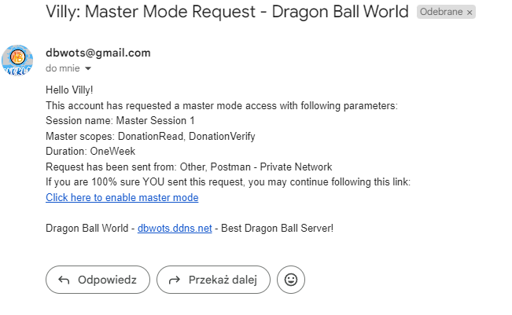

# DBWOTS API Clients Demonstration
 **DBWOTS API** is used in production environment and as of Feb 2024 serves as a back-end for the following clients:
- **DBWOTS Site** - React Web Application - [Visit](http://dbwots.ddns.net/) - [Learn More](#1-dbwots-site-react-web-application)
- **DBWOTS Launcher v2** - .NET WPF Desktop Application - [Learn More](#2-dbwots-launcher-net-desktop-application)
- *Other administrative tools for maintaining dbwots' gameserver and the database with singular endpoints*

Both main clients (React app & .Net desktop app) implement most functionalities of the API, sharing same endpoints. 
*All secrets, tokens, database records presented in this demonstration are created locally in dev environment and are safe to share.* 
*Main 'dbwots' project page: https://dbwots.pl/*

# 1. DBWOTS Site (React Web Application)
Built in React JS using JavaScript, HTML, CSS and MUI components library 
Project started in **May 2023** 
Released to production in **June 2023** 
Most recent major update **Feb 2024** *(2FA Support)* 

## 1.1 Authentication
### React App uses *PUT api/auth/authenticate* with account number and password, receives access token (to store in localstorage) and refresh token (as http-only cookie)

### API stores this session in database. This approach allows for advanced session management, ip-based logouts and unknown device alerts.

### The refresh token is stored as a http-only cookie (unable to be accessed by client-side scripts) and is sent back to API when client requests new access token.

## 1.2 Account Management
### API offers many options for user to modify or manage his account. React App implements the donation page, shard shop, referral system, password change, security options such as 2FA.

### Referral system:

### Donation page:

### Shard shop:

## 1.3 Email features
### API offers multiple email features such as account recovery, password change, master-mode (for administration)

## 1.4 Game Data requests
### Most of the endpoints are actually requesting public or access-protected resources from the DBWOTS game database, such as news articles, ongoing events, highscores, online players.

### The React App uses localstorage response caching to decrease average request count and load on the API (back-end rate limiting still takes care of any attacks from singular IP addresses, client-side caching just limits the API usage for average casual user)

### API also provides pagination for some endpoints. The example below shows how React sends a 'multi' requests limiting received object count to just 5, starting at specified index.

## 2. DBWOTS Launcher (.NET Desktop Application)
Built in .NET WPF using XAML, C# 
Project started & released to production in **June 2021** 
Most recent major update **June/July 2023** *(new 'DBWLauncher v2' with dbwots-api support)* 

### 2.1 Home Page

### 2.2 Create Account Page

### 2.3 Highscores Page

